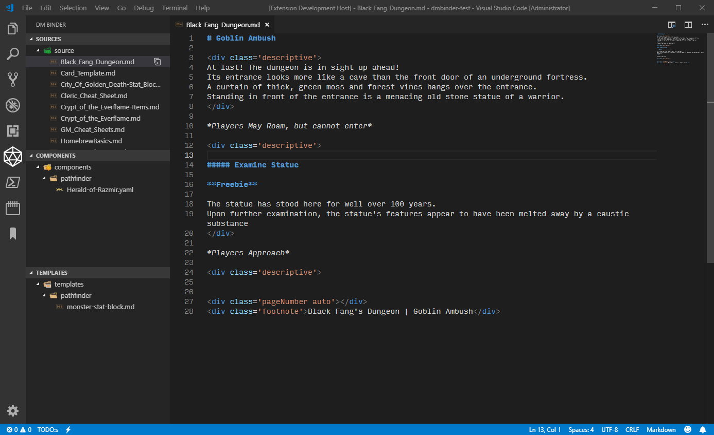
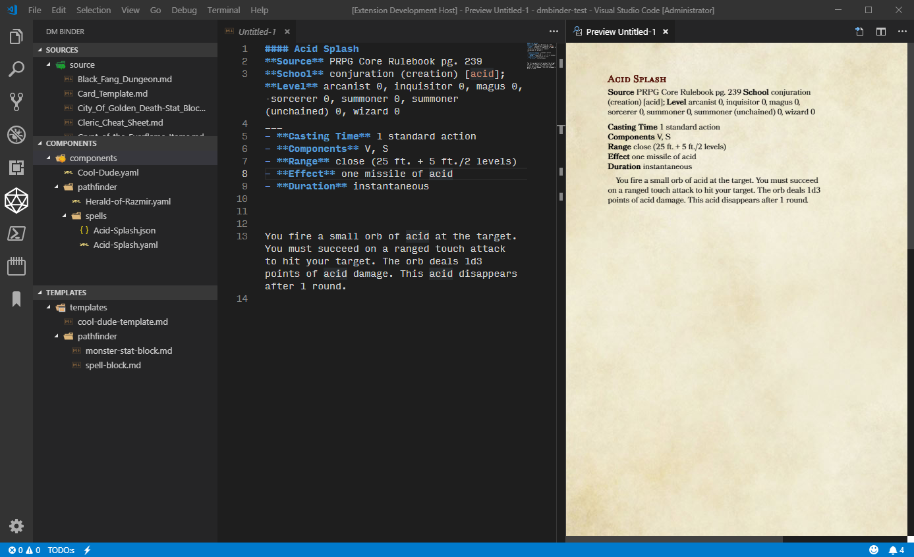
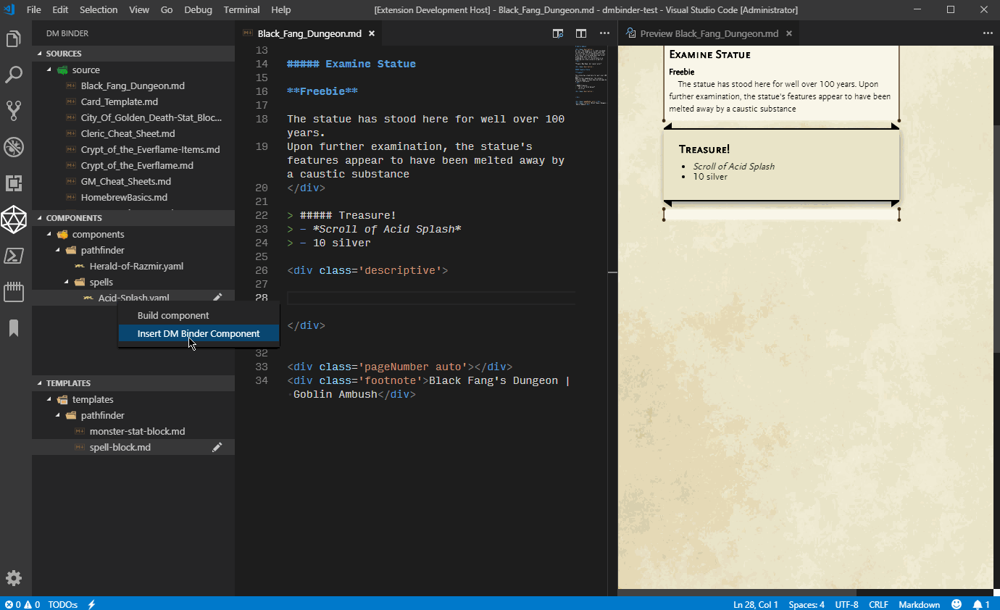
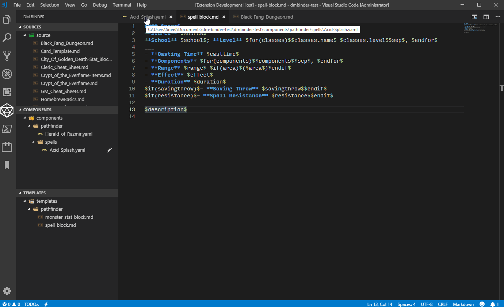
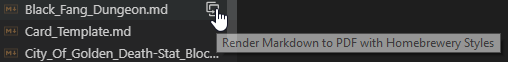
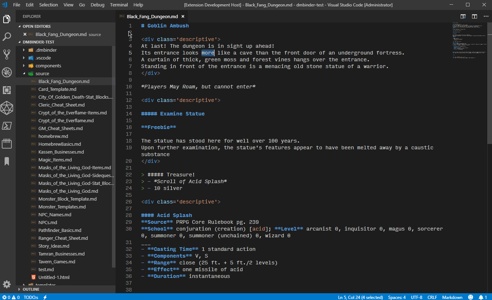

# vscode-dmbinder
Visual Studio Code extension for managing campaign documents.

## Requirements

- [Pandoc](https://pandoc.org) >= 2.3

## Features

- Generation of Hombrewery elements using snippets and Pandoc templating
- Rendering of markdown files to PDF using Puppeteer
- DMBinder view that helps organize campaign documents

<details>
<summary>DMBinder Explorer screenshot</summary>

The extension looks for `.dmbinder/campaign.json` in your workspace folders, and displays all DMBinder campaigns in the sidebar.



</details>

## Templates and Components
You can create **component** files that contain data that can be easily inserted into your campaign documents.
Component files can be either `.json` or `.yaml` files. (Both `.yaml` and `.json` examples are pictured in the "Template/Component Example" section, [below](#template-component-example))
More information on how to format the data used in component files can be found in Pandoc's [Metadata Block](https://pandoc.org/MANUAL.html#extension-yaml_metadata_block) documentation.
(Despite only having examples for `.yaml` metadata, Pandoc's [documentation](https://pandoc.org/MANUAL.html#option--metadata-file) does mention it supports `.json` data, as well)

**Template** files are used to specify how to insert the component data into your campaign document.
(Template files should be markdown, `.md`, files and should use [Pandoc](https://pandoc.org/MANUAL.html#using-variables-in-templates)'s variable syntax)

##### Template Component Example

Below are pictured an example template and component for the Pathfinder spell *Acid Splash*.

#### Spell Block Template
Example:
``` markdown
#### $name$
**Source** $source$
**School** $school$; **Level** $for(classes)$$classes.name$ $classes.level$$sep$, $endfor$
___
- **Casting Time** $casttime$
- **Components** $for(components)$$components$$sep$, $endfor$
- **Range** $range$ $if(area)$($area$)$endif$
- **Effect** $effect$
- **Duration** $duration$
$if(savingthrow)$- **Saving Throw** $savingthrow$$endif$
$if(resistance)$- **Spell Resistance** $resistance$$endif$

$description$

```

#### *Acid Splash* Component
`.yaml` Example:
``` yaml
---
templateItem: spell-block
name: Acid Splash
source: PRPG Core Rulebook pg. 239
school: conjuration (creation) [acid]
classes:
  - name: arcanist
    level: 0
  - name: inquisitor
    level: 0
  - name: magus
    level: 0
  - name: sorcerer
    level: 0
  - name: summoner
    level: 0
  - name: summoner (unchained)
    level: 0
  - name: wizard
    level: 0
casttime: 1 standard action
components:
  - V
  - S
range: close
area: 25 ft. + 5 ft./2 levels
effect: one missile of acid
duration: instantaneous
description: You fire a small orb of acid at the target. You must succeed on a ranged touch attack to hit your target. The orb deals 1d3 points of acid damage. This acid disappears after 1 round.
...
```

`.json` Example:
``` json
{
    "name": "Acid Splash",
    "source": "PRPG Core Rulebook pg. 239",
    "school": "conjuration (creation) [acid]",
    "classes": [
        {
            "name": "arcanist",
            "level": 0
        },
        {
            "name": "inquisitor",
            "level": 0
        },
        {
            "name": "magus",
            "level": 0
        },
        {
            "name": "sorcerer",
            "level": 0
        },
        {
            "name": "summoner",
            "level": 0
        },
        {
            "name": "summoner (unchained)",
            "level": 0
        },
        {
            "name": "wizard",
            "level": 0
        }
    ],
    "casttime": "1 standard action",
    "components": [
        "V",
        "S"
    ],
    "range": "close",
    "area": "25 ft. + 5 ft./2 levels",
    "effect": "one missile of acid",
    "duration": "instantaneous",
    "description": "You fire a small orb of acid at the target. You must succeed on a ranged touch attack to hit your target. The orb deals 1d3 points of acid damage. This acid disappears after 1 round."
}
```

#### Example Output


## Usage
In order to render files to PDF, you'll need to do one of the following:
- Point to a local Chrome installation by using `dmbinder.config.chooseChromePath`
- Set `dmbinder.chromeExecutablePath` to point an existing Chrome executable
- Download a version of Chromium by using `dmbinder.config.downloadChromiumRevision`


For best results when using `dmbinder.config.downloadChromiumRevision` to download Chromium instance for PDF rendering,
it is recommended to use the suggested revision or later.

### Component Basics

Component files are fairly simple. They simply contain named data attributes that can be used and reused to insert prebuilt snippets into your markdown formatted campaign documents.

`.yaml` example:
``` yaml
---
# This is a comment
singleAttribute: Single Value
parentAttribute:
  childAttribute: Nested Value
  otherChild:
    nestedAgain: Turtles all the way down
listAttribute:
  - Item 1
  - Item 2
  - Item 3
complexList:
  - itemTitle: Title 1
    itemBody: Body 1
    itemCoolAttribute: Cool Attribute 1
    coolnessFactor: 1
  - itemTitle: Title 2
    itemBody: Body 2
    itemCoolAttribute: Cool Attribute 2
    coolnessFactor: 10
...
```

`.json` example:
``` json
{
    "singleAttribute": "Single Value",
    "parentAttribute": {
        "childAttribute": "Nested Value",
        "otherChild": {
            "nestedAgain": "Turtles all the way down"
        }
    },
    "listAttribute": [
        "Item 1",
        "Item 2",
        "Item 3"
    ],
    "complexList": [
        {
            "itemTitle": "Title 1",
            "itemBody": "Body 1",
            "itemCoolAttribute": "Cool Attribute 1",
            "coolnessFactor": 1
        },
        {
            "itemTitle": "Title 2",
            "itemBody": "Body 2",
            "itemCoolAttribute": "Cool Attribute 2",
            "coolnessFactor": 10
        }
    ]
}
```

##### Note:
If using `.yaml` components, the metadata needs to be preceeded with `---` and proceeded with `...` so that Pandoc will recognize the data

### Template Basics

Despite looking somewhat messy, Pandoc's templating system was implemented over using VS Code or TextMate "snippets", due to their benefits, particularly regarding the handling of lists and conditional logic. Template files should look just like regular Markdown (`.md`) files, but with specially formatted placeholders that will be replaced with the data from a component. This allows, for example, all the descriptive blocks (spells, items, monsters, NPCs, magic shops, cities, etc) in your campaign documents to have a similar and consistent layout. Gone are the days where the order of monster stats changed from monster to monster!

There are 3 main features of Pandoc's templating system:
- Variables: `$variableName$`
- Conditions: `$if(variableName)$Render if variable has value: $variableName$. Cool, right?$endif$`
- Loops: `$for(listVariable)$Each value: $listVariable$$sep$, $endfor$`

#### Variables

Variables are accessed based on the names defined in the component files and nested variables are accessed using the `.` character to denote a nested attribute.

<details>
<summary>Example:</summary>

##### Component

``` yaml
---
name: Cool Dude
equipment:
  weapon: Greatsword
  armor: Plate Mail
...
```

##### Template

``` markdown
**Name:** $name$
$name$ wields a *$equipment.weapon$* and is protected by their hardy *$equipment.armor$*.
```

##### Output

``` markdown
**Name:** Cool Dude
Cool Dude wields a *Greatsword* and is protected by their hardy *Plate Mail*.
```

</details>

#### Conditions
Conditions can control if content listed between the opening statement and the closing statement are output, based on checking if a variable exists.

<details>
<summary>Example:</summary>

##### Component
``` yaml
---
name: Cool Dude
equipment:
  meleeWeapon: Greatsword
  armor: Plate Mail
...
```

##### Template
``` markdown
**Name:** $name$
$name$ wields a *$equipment.weapon$*$if(equipment.armor)$ and is protected by their hardy *$equipment.armor$*$endif$.
$if(equipment.rangedWeapon)$$name$ also is pretty handy with their $equipment.rangedWeapon$, too!$endif$
```

##### Output
``` markdown
**Name:** Cool Dude
Cool Dude wields a *Greatsword* and is protected by their hardy *Plate Mail*.
 
```

The part about the armor is output because `equipment.armor` has a value, but the next line is blank because there is no `equipment.rangedWeapon` defined in the component metadata.

</details>

***Important Note:***
Notice that in the example provided, there is a blank line displayed at the end, because there is a new line *before* the `$if(equipment.rangedWeapon)$`. In order to not see that empty line, you would need to start the `$if()$` statement at the end of the previous line like so:
``` markdown
**Name:** $name$
$name$ wields a *$equipment.weapon$*$if(equipment.armor)$ and is protected by their hardy *$equipment.armor$*$endif$.$if(equipment.rangedWeapon)$
$name$ also is pretty handy with their $equipment.rangedWeapon$, too!$endif$
```
*This* is why template files can start to look incredibly messy using Pandoc, but the benefits can outweigh the clutter.

#### Loops
Loops are a great way to format a list of data!

<details>
<summary>Example:</summary>
  
##### Component

``` yaml
---
name: Cool Dude
equipment:
  weapon: Greatsword
  armor: Plate Mail
inventory:
  - Bag of Holding
  - Bedroll
  - Rations (x7)
  - 7 gp
saleItems:
  - name: +1 *Ring of Protection*
    cost: 2,000 gp
  - name: Masterwork Crossbow
    cost: 100 gp
...
```

##### Template
``` markdown
**Name:** $name$
$name$ wields a *$equipment.weapon$* and is protected by their hardy *$equipment.armor$*.
**Inventory:**
$for(inventory)$
- $inventory$
$endfor$
**Items For Sale:**
| Name | Cost |
|:----:|:----:|
$for(saleItems)$
| $saleItems.name$ | $saleItems.cost$ |
$endfor$
```

##### Output
``` markdown
**Name:** Cool Dude
Cool Dude wields a *Greatsword* and is protected by their hardy *Plate Mail*.
**Inventory:**
- Bag of Holding
- Bedroll
- Rations (x7)
- 7 gp
**Items For Sale:**
| Name | Cost |
|:----:|:----:|
| +1 <em>Ring of Protection</em> | 2,000 gp |
| Masterwork Crossbow | 100 gp |

```

</details>

### Loops Separator

Another nifty feature of Pandoc is that you can define a separator for loops.
The separator is optional and is specified at the very end of the loop.
If present, anything put between `$sep$` and the `$endfor$` will be added between every item in the list.
For instance, if you wanted a list to generate a comma separated list you could do something like this:

<details>
<summary>Example:</summary>

Component:
``` yaml
name: Cool Dude
inventory:
  - a Bag of Holding
  - a bedroll
  - rations (x7)
  - 7 gp
```

Template:
``` markdown
**Name:** $name$
$name$ is holding $for(inventory)$$inventory$$sep$, $endfor$.
```

Output:
``` markdown
**Name:** Cool Dude
Cool Dude is holding a Bag of Holding, a bedroll, rations (x7), 7 gp.
```

</details>

### Inserting A Component

You can insert a component by right clicking the component in the DMBinder view, unless specified in the component data, you will then be prompted to select the template to use to format the component data.

#### Inserting vs. Building Component
Selecting "Insert component" or using the command `dmbinder.component.insert`, inserts the formatted component at the cursor location of the currently opened document.

Selecting "Build component" or using the command `dmbinder.component.build`, outputs the formatted component into a new document.

<details>
<summary>Screenshot:</summary>

Inserting a component example:


</details>


### Specifying Template in the Component File

Optionally, you may include a `templateItem` attribute in your component that will specify the name of the template file to use.
**Note:** Unfortunately, this functionality doesn't currently work with `.json` component files

<details>
<summary>Screenshot:</summary>



</details>


### Rendering to PDF

In order to use the render to PDF functionality, you will need to either point to the location of an already installed instance of Google Chrome or download an instance of Chromium which will be used to render the PDFs.
There should be a message on startup or if you try to render without first setting that up that will allow you to point to Chrome or download Chromium.
In the DMBinder Explorer, you can click on the "Render Markdown to PDF with Homebrewery Styles" icon, to the right of a source item:


<details>
<summary>Screenshot:</summary>



</details>

Additionally, you can render all sources for a single campaign by using the `dmbinder.campaign.brew` command. If there is more than one campaign in the current workspace, it will list all of them and prompt you to select which campaign.

### Included Snippets
Coming Soon!

### Using Yeoman Generator
Coming Soon!

## campaign.json
Below is an example Campaign configuration file:
``` json
{
    "campaignName": "My Cool Campaign",
    "sourcePaths": [
        "./source/"
    ],
    "templatePaths": [
        "./templates/"
    ],
    "componentPaths": [
        "./components/"
    ],
    "outDirectory": "./out/"
}
```

See [generator-dmbinder](https://github.com/jsnee/generator-dmbinder) for a yeoman generator to help bootstrap a campaign binder.

See [Changelog](CHANGELOG.md) for release notes.

-----------------------------------------------------------------------------------------------------------

## Icon Sources
- [Material Design Icons](https://materialdesignicons.com/)
- Official icons (various icons from Microsoft's vscode repo)
- [GitHub's Octicons](https://github.com/primer/octicons/tree/master/lib/octicons_node) using [Microsoft's vscode icon tool](https://github.com/microsoft/vscode-octicons-font)

## Related Projects
- [Homebrewery](https://github.com/naturalcrit/homebrewery)
- [homebrewery-vscode](https://github.com/OfficerHalf/homebrewery-vscode)
- [simple-pandoc](https://www.npmjs.com/package/simple-pandoc)